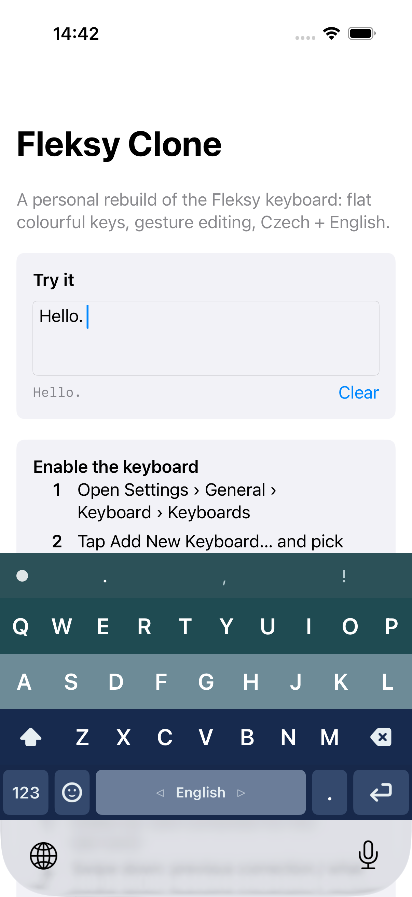
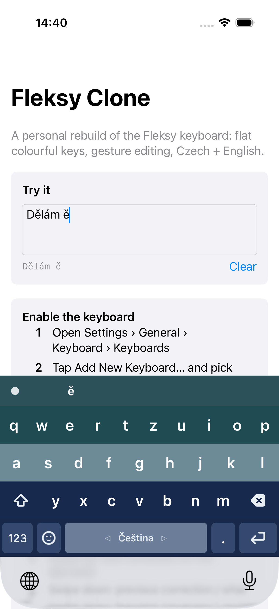
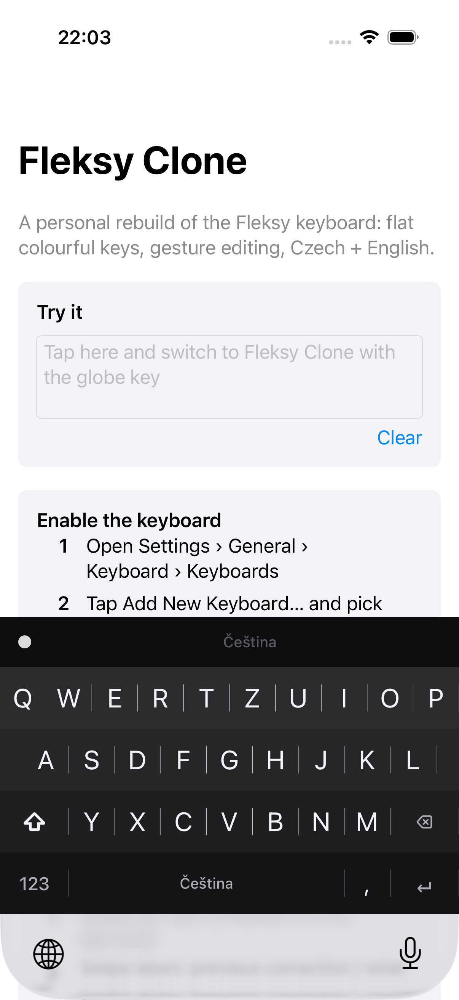
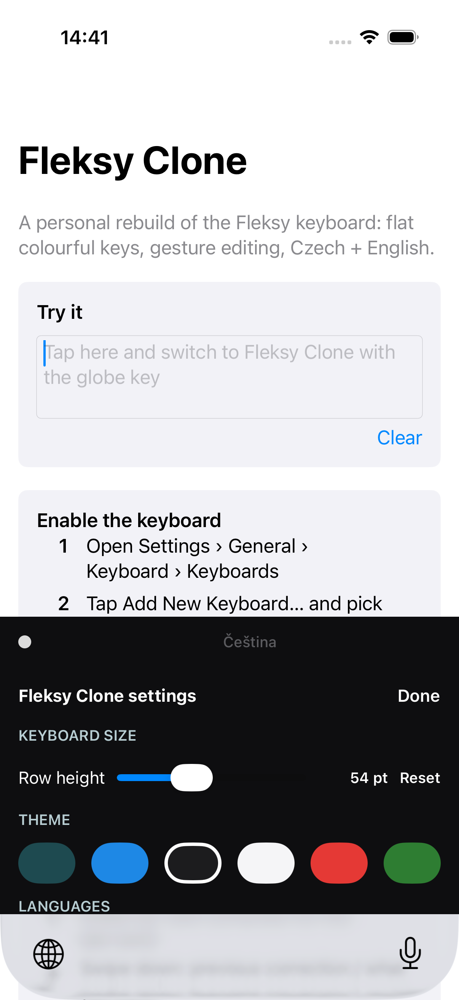

# Fleksy Clone

A personal iOS keyboard extension that recreates the Fleksy typing experience:
flat colour-band keys, gesture editing, quick swapping of autocorrected words, and
Czech + English with diacritic-aware correction ("delam" → "dělám").

## Gestures

| Gesture | Action |
|---|---|
| Swipe right | space (and autocorrect the word). Swipe right again: period |
| Swipe left | delete the previous word |
| Swipe down / up | next / previous suggestion for the last word. The word you typed is always leftmost; swipe up ends on it, another swipe up learns it ("✓ learned"), another forgets it ("✓ forgotten"). Flip the direction with "Swipe ↓ = next word" in settings |
| Swipe up / down with nothing pending | reach back to the last word in the text and walk its autocorrections again |
| Swipe on the space bar, or two-finger swipe left/right | switch Čeština ⇄ English |
| Two-finger swipe down | hide the keyboard |
| Hold a letter | accent popup (ě š č ř ž ý á í é ú ů …), slide to choose |
| Hold backspace | repeat delete |
| Two keys at once | both are typed - every finger is tracked separately, so fast rollover never drops a letter |
| Double-tap shift | caps lock |
| Tap the dot left of the suggestions | settings: keyboard size, theme, languages, QWERTZ/QWERTY, autocorrect, swipe direction |

## Autocorrect

Three things decide what a typed word becomes, in `Packages/FleksyCore`.

**The word list** (`Lexicon`, `Corrector`). Weighted Damerau-Levenshtein against a
frequency-ranked list per language, with diacritics costed as a near-free edit so
"delam" reaches "dělám". Lists come from FrequencyWords (OpenSubtitles 2018), ~47k
words each, merged with a name list (below).

**Where you actually tapped** (`SpatialModel`). The keyboard passes the touch point of
every letter, not just the key it resolved to. A tap on the g/h border costs almost
nothing to reread as either letter, while one dead in the middle of g is expensive to
overrule — so you can type quickly without aiming. This replaces the old flat "these two
keys are adjacent" rule; a key the finger was demonstrably nowhere near is no longer
treated as a cheap substitution. It also made correction *faster* (5.3 → 3.4 ms/word),
because confident taps let the edit-distance early exit fire sooner.

**What you type** (`PersonalModel`). Every committed word and word pair is counted, so
the keyboard learns your vocabulary without any shipped data and in any language. A word
used twice becomes a suggestion; a word used often stops being corrected away; a pair you
have written before is preferred in that position only. Counts halve every 60 days so old
habits fade, and are capped at 3000 words / 6000 pairs (~0.05 MB). Swiping to learn a word
still works and marks it permanently.

Everything is on-device. The counts live in a JSON file in the extension's own container,
never leave the phone, and "Forget what I've typed" in settings deletes them.

## Names

Because the word lists come from film subtitles, they knew the names that get *said in
films* and not much else. English came off well — of the top 1000 US surnames only ~90
were missing — but Czech was bad: of 32 common Czech names, 16 were absent and every one
of those was mangled (Kučera → kamera, Adéla → dělá, Šárka → sakra, Novák → novak).

`scripts/build-names.py` regenerates `names-{cs,en}.txt` from public name statistics
(MV ČR for Czech, US Census 2010 for English; see `Resources/Dictionaries/LICENSE.txt`).
The lists are loaded alongside the word list rather than merged into it, so the two keep
their separate sources and licences. Adding them costs ~0.2 MB and no measurable latency.

Three things turned out to matter more than the data itself:

- **Diacritics are the whole point.** The commonly cited Czech name list is romanised;
  adding `novak` without `novák` makes correction *worse*, not better.
- **A name must never outrank a word it folds onto.** *Dostál* is a surname, but "dostal"
  is the past tense of "get", and sakra, nic and pan are words long before they are
  anyone's name. Names that collide with a more common word are ranked below it.
- **Only the majority spelling.** The sources list spellings separately, so `Ondřej`
  (60,248 people) and `Ondrej` (1,951) both appear. Adding the minority one shadows the
  correct one — which is exactly how the first cut of this list made the keyboard
  "correct" Ondřej into Ondrej.

Measured over 3,600 common words and a typo of each: no ordinary word's correction
changed in either language, and 4 typos per language now resolve to the name whose
accent-free spelling they exactly match. `RealLexiconTests` covers both directions.

## Memory

A keyboard extension is killed without warning — no crash log, iOS just switches back to
the system keyboard — somewhere past ~50 MB. Both languages loaded used to account for
33.5 MB of that; they now take ~9 MB, names included.

Most of the saving was not in the layout but in the *build*: what the allocator touches
while parsing is never returned to the OS, so an intermediate array of 47k Strings costs
as much as keeping one. `Lexicon` therefore streams the word list line by line straight
into flat scalar buffers, sorts an index permutation rather than the words, and keeps no
per-word allocations at all. `testLexiconMemoryFootprint` guards the result.

## Keyboard size

The first section of the in-keyboard settings sets the row height (38-82 pt, default 54),
with a live readout and a Reset button. It applies immediately and is remembered.

On Face ID iPhones iOS draws its own grey bar with the globe and dictation keys *below*
the keyboard (`UIKeyboardDockView`, in the host app's process). It is not part of this
extension and there is no public API to hide or shrink it - Apple's HIG says outright that
"your app can't affect these keys". The keyboard already drops its own globe key when the
system provides one, so the only way to buy back vertical space is the row height slider.

## Layout

```
Packages/FleksyCore     pure Swift engine (layouts, gestures, lexicon, corrector, composer, themes) + unit tests
Keyboard/               the keyboard extension (custom-drawn UIKit view)
App/                    host app: onboarding + test field
UITests/                XCUITest that types on the real keyboard in the Simulator
Resources/Dictionaries  cs.txt / en.txt frequency lists + generated name lists (see LICENSE.txt)
scripts/build-names.py  regenerates the name lists from public statistics
scripts/simulator.sh    the test runner: unit / smoke / full tiers, and Simulator plumbing
```

## Build

Requirements: Xcode 26, `brew install xcodegen`.

```sh
xcodegen generate            # regenerate FleksyClone.xcodeproj from project.yml
scripts/simulator.sh         # unit tests (the default)
```

## Testing

Driving the real keyboard in the Simulator is slow, and most changes do not need it, so
the runner has three tiers. Each one runs the tier below it first.

```sh
scripts/simulator.sh unit    # 115 FleksyCore tests, no Simulator          ~8s   (default)
scripts/simulator.sh smoke   # + one UI test per wiring path               ~65s
scripts/simulator.sh full    # + the whole XCUITest suite                  ~150s
```

Run `unit` while working, `smoke` before committing, `full` before pushing or after
touching anything in `Keyboard/`.

The engine is where the behaviour lives and where it is cheap to test; the UI tests exist
to prove the wiring — that touches reach the composer, that settings reach the keyboard,
that the panels open. `smoke` runs one test for each of those three paths.

A note if you are adding UI tests: resolving an element costs about 1.1s against 0.4s for
the tap itself, which is why `key(_:)` caches. Prefer `exists` to `waitForExistence` for
something that should already be on screen.

## Run on your iPhone

1. Open `FleksyClone.xcodeproj` in Xcode, select the `FleksyClone` target and set your
   personal team under Signing & Capabilities (do the same for `FleksyKeyboard`).
   Change the bundle identifiers if the defaults collide with something on your account.
2. Connect the phone, pick it as the run destination and press Run.
3. On the phone: Settings › General › Keyboard › Keyboards › Add New Keyboard… › Fleksy Clone.
   Full Access is *not* required; everything runs on-device.
4. In any text field hold the globe key and choose Fleksy Clone.

With a free personal team the app must be reinstalled every 7 days.

## Screenshots (iPhone 17 simulator, iOS 26.5)

| English | Czech + accent popup result | Midnight theme | Settings |
|---|---|---|---|
|  |  |  |  |
